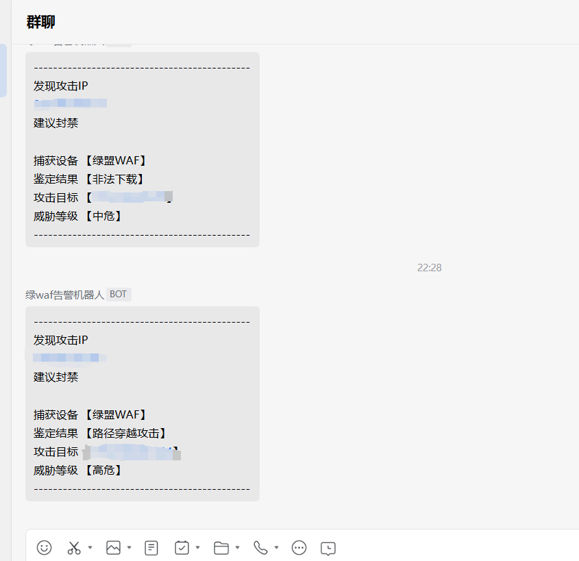

# WafReport

针对 **绿盟WEB应用防护系统WAF** 的辅助工具，对**Web安全日志**模块自动采集，并加入企业微信机器人自动发送告警信息

**初衷是解放双手，减少安服人员重复、机械的工作内容**


自动完成以下流程：

- 检测目标是否可访问；
- 定时获取最新告警事件；
- 自动识别是否为新增攻击；
- 输出到终端，并同步推送到企业微信

ps：既然已经是攻击，获取到告警我们自己再去判断，工具主要是**提醒**有攻击

## 使用

1.对应的产品和功能

2.运行

`Config\botkey.txt`写入机器人的Webhook地址

 


**建议别用`cmd`运行，或者关闭快速编辑模式 不然切屏或者点鼠标会卡住**


```
WafReport.exe -u 设备地址 -c "cookie" -t 多少分钟获取一次

例：WafReport.exe -u https://192.168.x.x -c "cavy_locale=zh_CN; PHPSESSID=0xxxccccc6f517; top_menustatue_NSFOCUSWAF=2,0,0" -t 2	
```

3.效果

终端会输出一次，然后在机器人会同步 

模版根据`/log/websec/viewDetail?id=`的响应结果按需更改


 

这样我们只需什么时候听见群消息，什么时候点上去看即可 


Github地址：`https://github.com/Seven1an/WafReport`

